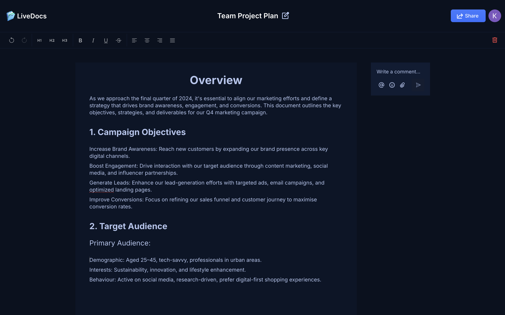
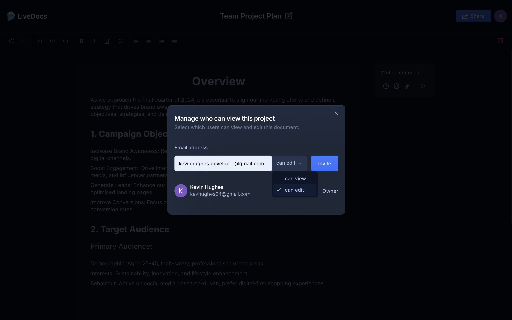
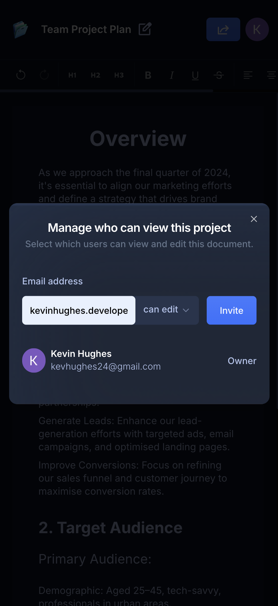

# LiveDocs

#### LiveDocs is a fully responsive collaborative document app built with React, Next.js, Typescript and Liveblocks.

Use the app [here](https://live-docs-sepia-six.vercel.app)

# Description
LiveDocs is a fully responsive online word processor that offers a seamless, collaborative writing experience. Much like Google Docs, it empowers users to work together on documents in real time, allowing multiple individuals to edit, comment, and track changes simultaneously. 
 
# Take a Look at the App

## Desktop:
#### Word processor features

#### Invite a collaborator

## Mobile:

#### Word processor features
<kbd>

</kbd>

#### Invite a collaborator
<kbd>

</kbd>

# Tools Used

### Development Environment
* Node.js

### Libraries & Frameworks
* React 
* Next.js

### Other
* TypeScript - static typing for JavaScript, improves code quality and debugging
* Clerk - user authentication
* Liveblocks - real-time collaboration platform 
* Lexical Editor - high-performance, customizable rich text editor for React
* ShadCN UI Components - pre-built UI components using React and Tailwind CSS
* Tailwind CSS - utility-first CSS framework
* Sentry - real-time error tracking and performance monitoring

### Hosting 
* Vercel

# Features

### Users are able to:

* Log in securely using Google authentication via Clerk for a seamless and streamlined sign-in experience.
* Create new collaborative word documents from scratch.
* Edit documents in real-time with instant, synchronized updates that are visible to all collaborators ensuring smooth collaboration without any delays.
* Delete documents when no longer needed.
* Invite collaborators to view or edit documents, easily granting access to the right people at the right time.
* Comment on specific parts of the text, allowing for focused feedback or discussions that all collaborators can view and respond to in real-time.
* Add emojis to comments to convey tone, emotions, or reactions, enhancing communication within the document.
* Tag collaborators within comments, ensuring that specific individuals are notified and can respond directly to relevant parts of the document.
* Attach files to comments, making it easy to share documents, images, and other resources with collaborators instantly.
* Leave general comments within the document, providing ongoing feedback that all team members can see and engage with.
* Receive automatic notifications whenever collaborators are invited, tagged, or when new comments are made keeping everyone in the loop and ensuring timely responses.
